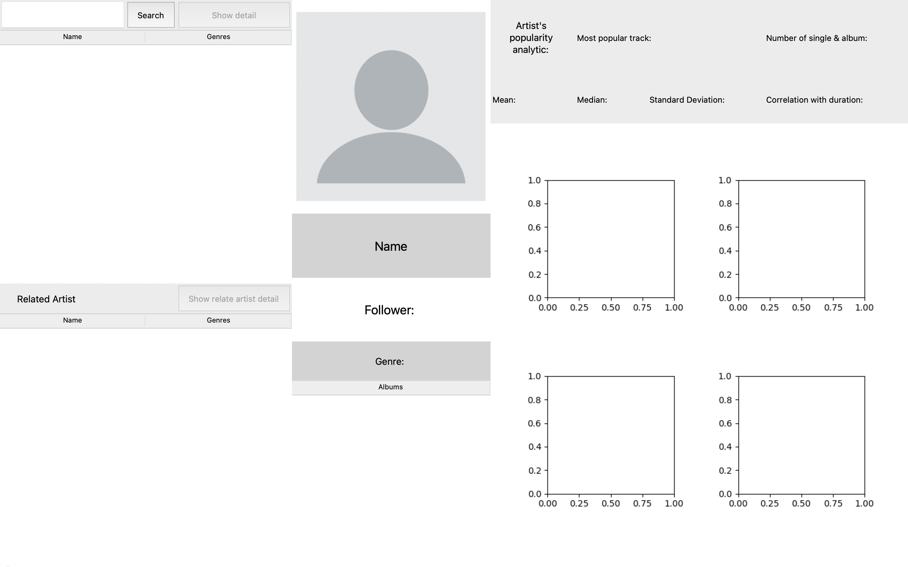

# More like this

## Description: 

More like this is an application for learn more about your favourite artist. By utillizing Spotify Web API via spotipy library, This application able to show information about every artist that available on Spotify along with their related artist and data analytics about their discography popularity.

## UML diagram


## Sequence diagram


## Setup instruction

### Install requirement package
```pip install -r requirement.txt```

### Get API keys
Obtain Spotify API client ID and client secret from [This link](https://developer.spotify.com/dashboard) 
by follow instruction 1-3 in [This link](https://stevesie.com/docs/pages/spotify-client-id-secret-developer-api) 

### Set API keys

Create a file call .env by run `echo .env`

Paste this message into [.env](.env) file
```
SPOTIPY_CLIENT_ID="*Your client id*"
SPOTIPY_CLIENT_SECRET="*Youe client secret key*"
```

## Running program instruction
Run `python main.py`

## Application detail

### Start up page
 

You can search up any artist that available on spotify

### After click search button


Program will show search result under search bar. 
You can click on artist name to select that artist then 
click on show detail button to show more detail and analyzing about them.

### After click on show detail button
 

After click on show detail button program will display selected artist information and their popularity statistics.
Also on relate artist will show selected artist's relate artists and able to click on them to show more detail about 
that selected relate artist.

### Founded issue

* Application randomly freeze need to move window a little to make it run properly again

### Data source
[Spotify Web API](https://developer.spotify.com/documentation/web-api)